# Windows Event Log Analysis & Attack Simulation Lab

## Project Overview

This project focused on analyzing Windows security telemetry using **Windows Event Logs** and **Sysmon** in a controlled lab environment. The goal was to replicate several common attack techniques, generate observable Windows events, and identify key indicators from the logs that a SOC Analyst would use during detection and investigation.

The lab involved three main attack simulations:

1. **DLL Hijacking**
2. **Unmanaged PowerShell Injection**
3. **Credential Dumping**

Each technique was executed inside an isolated training target, and the resulting telemetry was reviewed using Windows Event Viewer, Sysmon Operational logs, and PowerShell-based log queries.

This project helped me practice how a SOC Analyst moves from an alert or suspicious event to evidence-based investigation using host logs.

---

## Lab Objective

The objective of this project was to understand how malicious or suspicious activity appears in Windows logs and how those logs can be used to support detection, investigation, and incident response.

Specifically, this project focused on:

- Understanding the structure of Windows Event Logs.
- Using Event Viewer to inspect system, security, and Sysmon logs.
- Using Sysmon to identify process activity, DLL loading, and suspicious execution behavior.
- Replicating controlled attack techniques to generate forensic evidence.
- Extracting useful indicators such as file hashes, loaded DLLs, process names, and user credential artifacts.
- Connecting technical findings to SOC Analyst workflows.

---

## Environment

The project was completed in a controlled cybersecurity training environment.

**Environment details:**

- Platform: Hack The Box Academy lab environment
- Operating System: Windows target machine
- Access Method: RDP
- User Context: Administrator
- Logging Tool: Sysmon
- Analysis Tools:
  - Windows Event Viewer
  - PowerShell
  - Sysmon Operational Logs
  - Mimikatz lab binary
  - PSInject lab files
  - Reflective DLL Injection lab files

> **Note:** All activity was performed in an isolated lab environment for educational and defensive security training purposes.

---

## Tools Used

| Tool | Purpose |
|---|---|
| Windows Event Viewer | Reviewed Windows and Sysmon event logs |
| Sysmon | Collected detailed host telemetry |
| PowerShell | Queried event logs and calculated file hashes |
| Get-WinEvent | Searched Windows logs from the command line |
| Get-FileHash | Extracted SHA256 hashes from suspicious DLLs |
| Reflective DLL Injection files | Used to simulate DLL hijacking |
| PSInject | Used to simulate unmanaged PowerShell activity |
| Mimikatz lab binary | Used to simulate credential dumping behavior |

---

## Skills Demonstrated

This project demonstrates the following SOC Analyst skills:

- Windows log analysis
- Sysmon event investigation
- Event ID filtering
- DLL load analysis
- Process-based investigation
- File hash extraction
- Credential dumping detection awareness
- PowerShell-based log querying
- Evidence collection and documentation
- Mapping suspicious activity to attacker behavior

---

## Evidence Screenshots

> Sensitive lab values such as passwords, target IPs, and answer hashes should be redacted before screenshots are committed.

### 01. RDP connection command

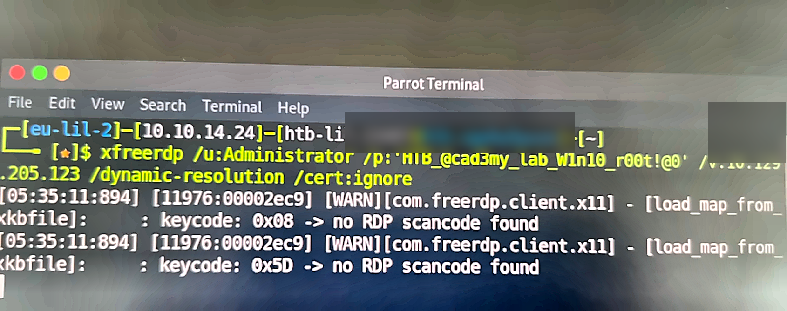

### 02. Sysmon ImageLoad rule configuration

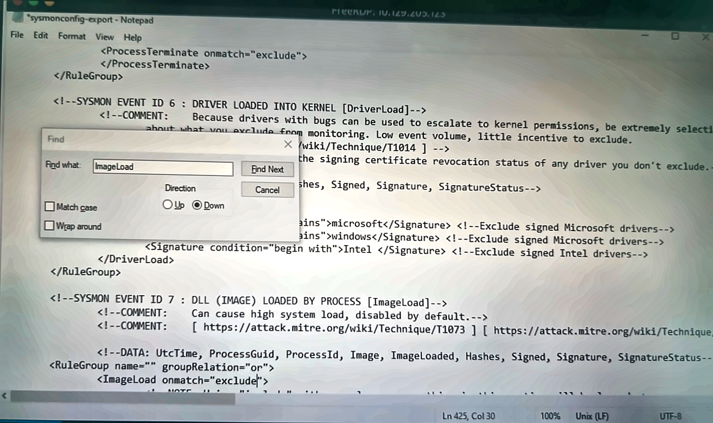

### 03. Sysmon configuration updated and Reflective DLL folder

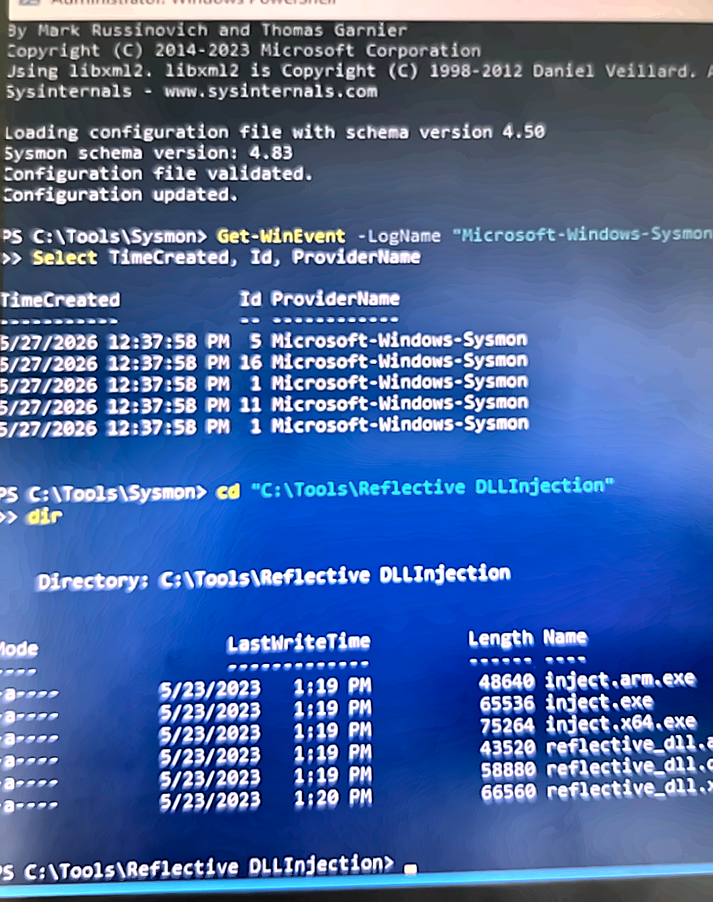

### 04. DLL hijack folder and WININET copy

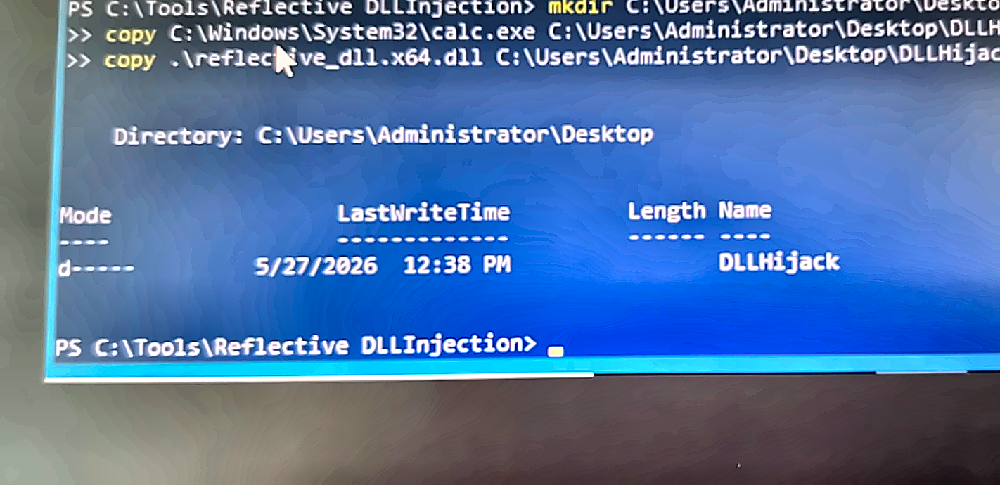

### 05. DLL hijacking execution with DllMain popup

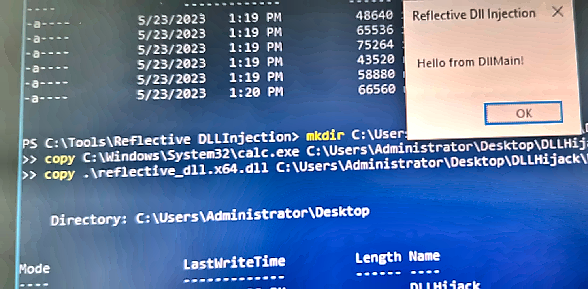

### 06. Sysmon WININET image load event

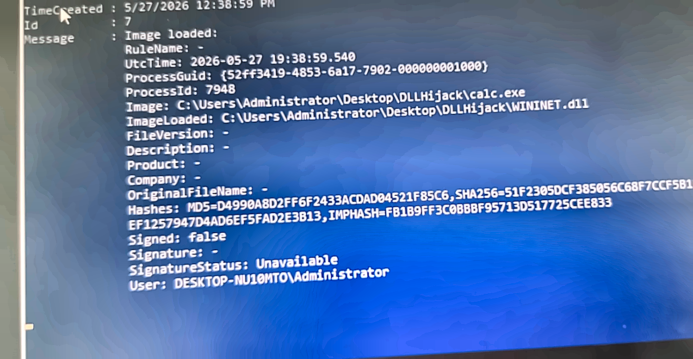

### 07. WININET SHA256 Get-FileHash output

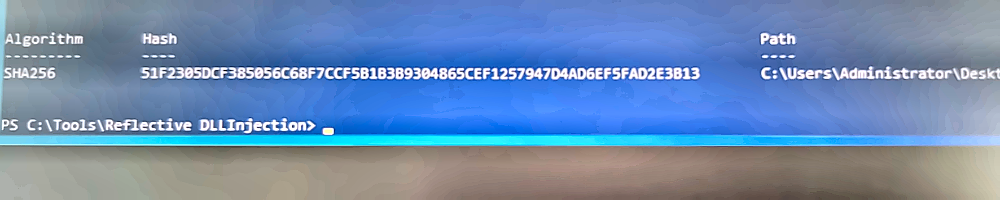

### 08. Sysmon Event ID 7 Event Viewer details

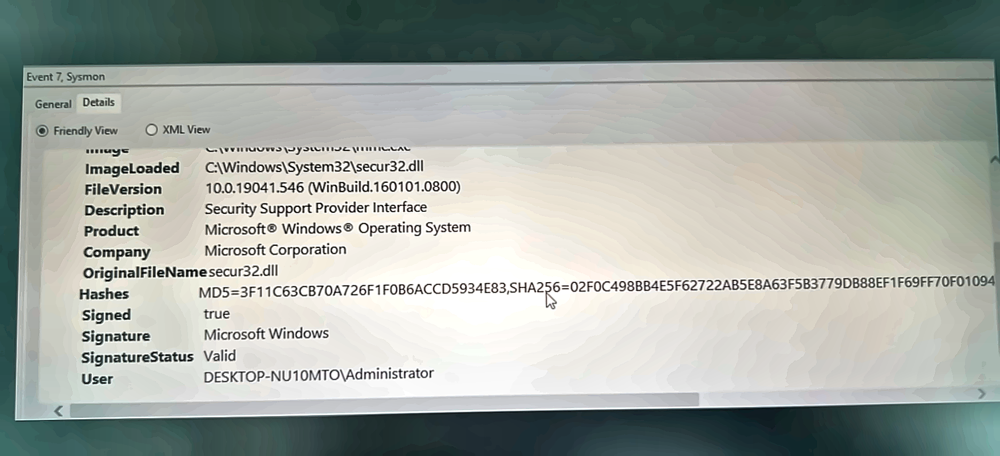

### 09. PSInject folder and Event ID 7 confirmation

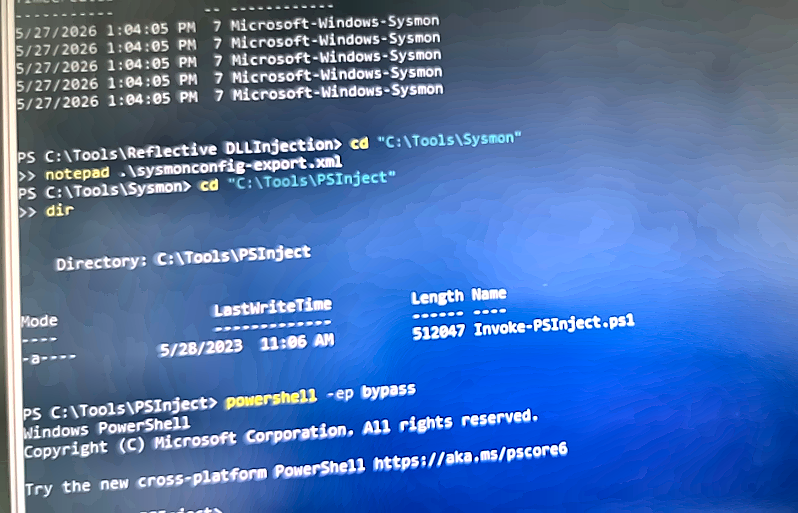

### 10. PSInject spoolsv injection query

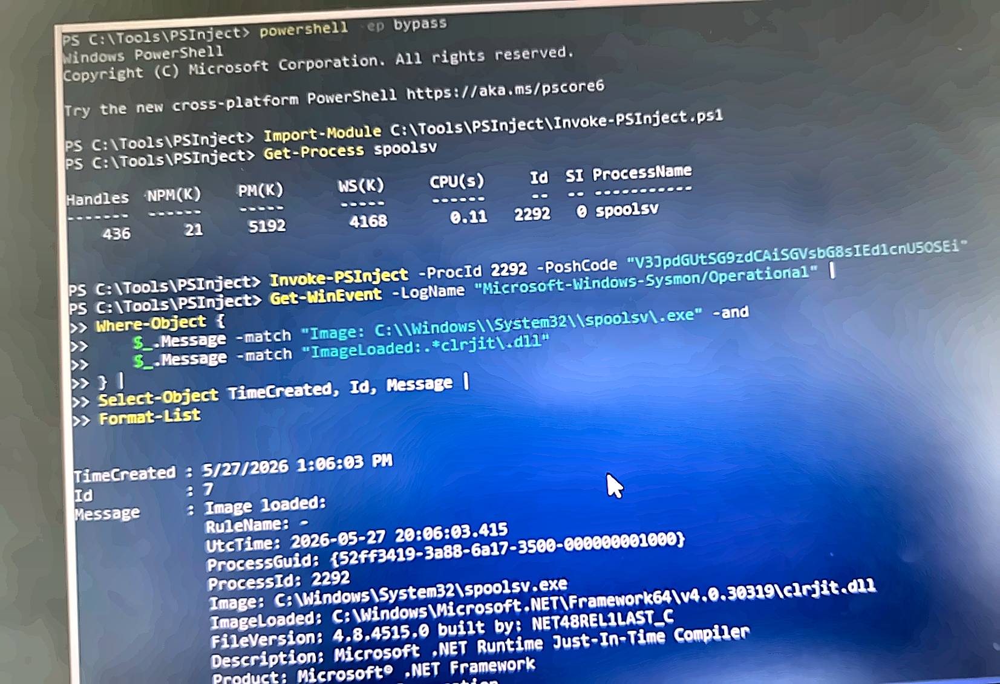

### 11. Sysmon spoolsv clrjit image load hash

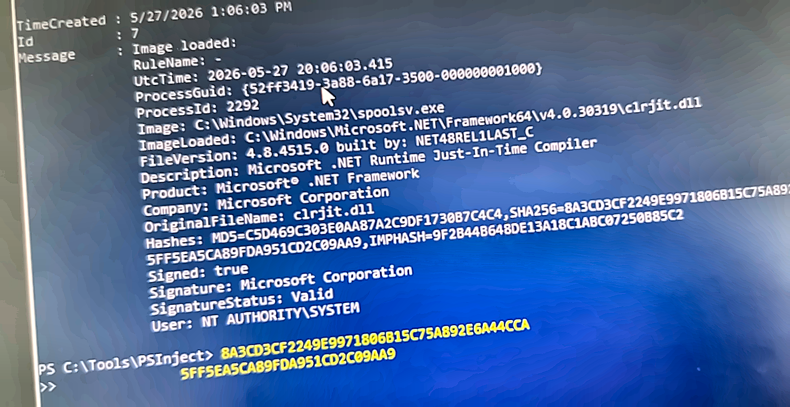

### 12. Question 2 answer accepted

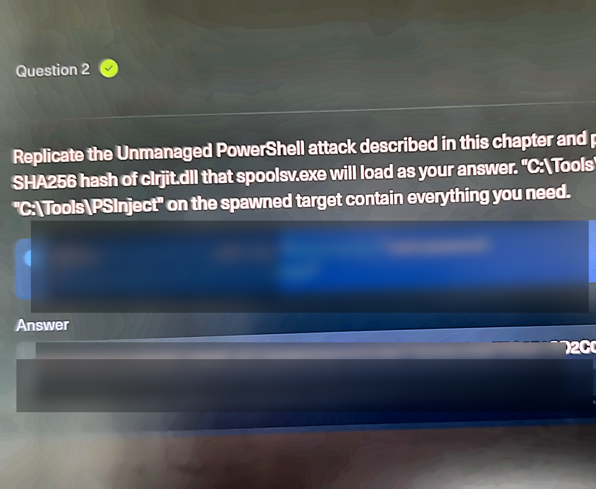

### 13. Mimikatz folder contents

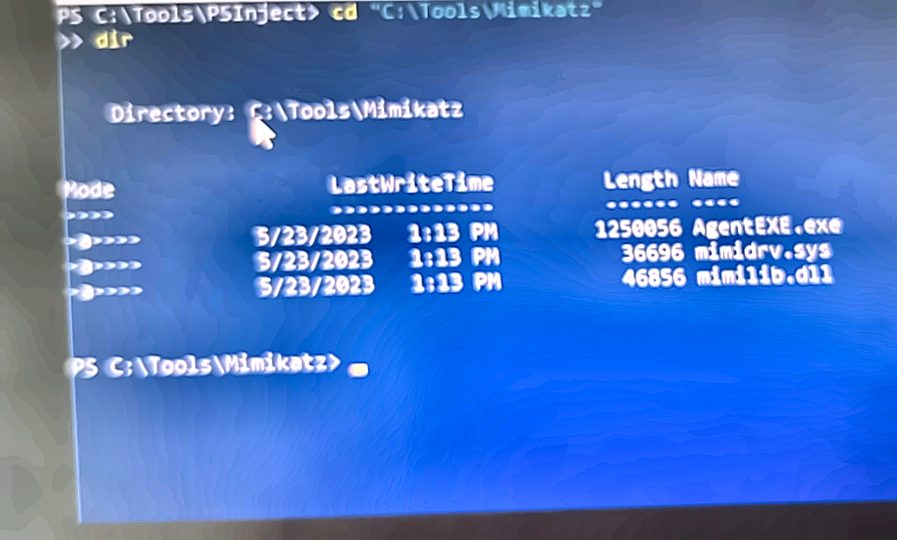

### 14. Mimikatz execution privilege debug

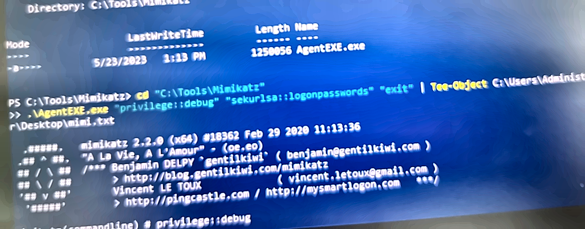

### 15. Mimikatz logonpasswords Administrator NTLM

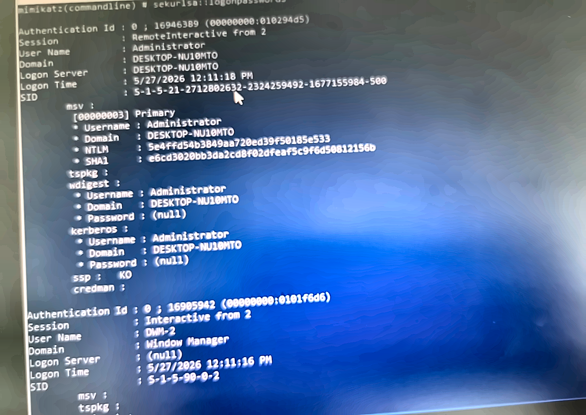

### 16. Select-String Administrator NTLM output

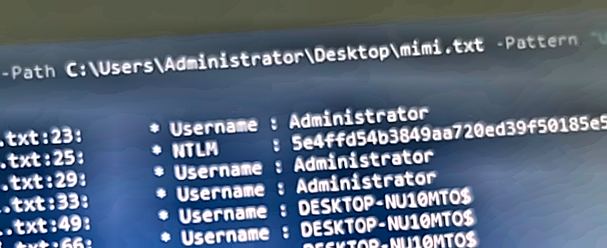

### 17. Select-String username NTLM results

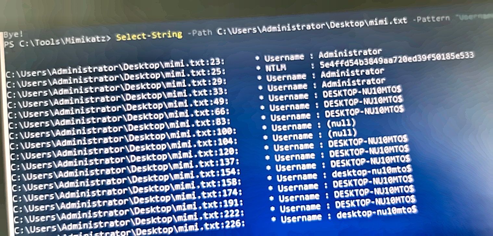

### 18. Select-String NTLM results wide

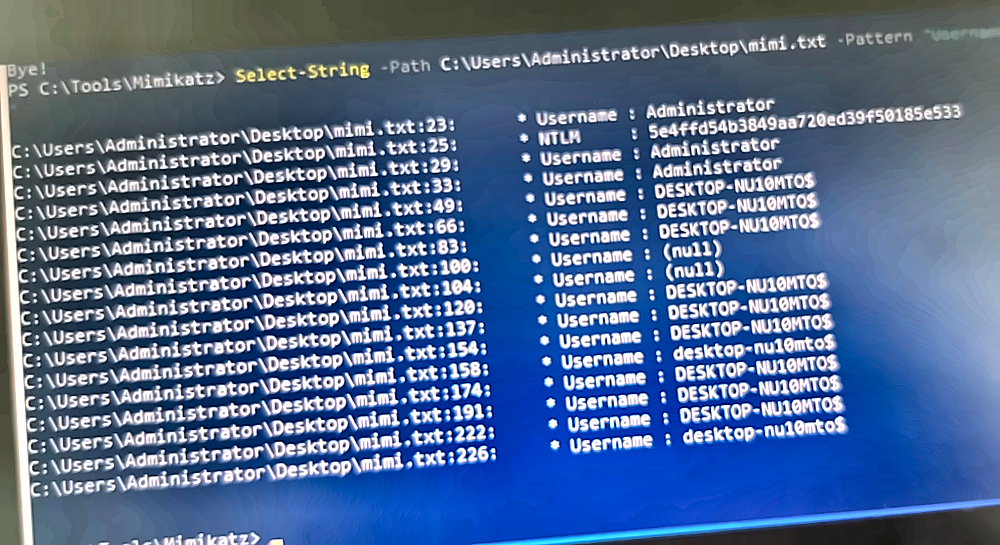

### 19. Question 3 answer accepted

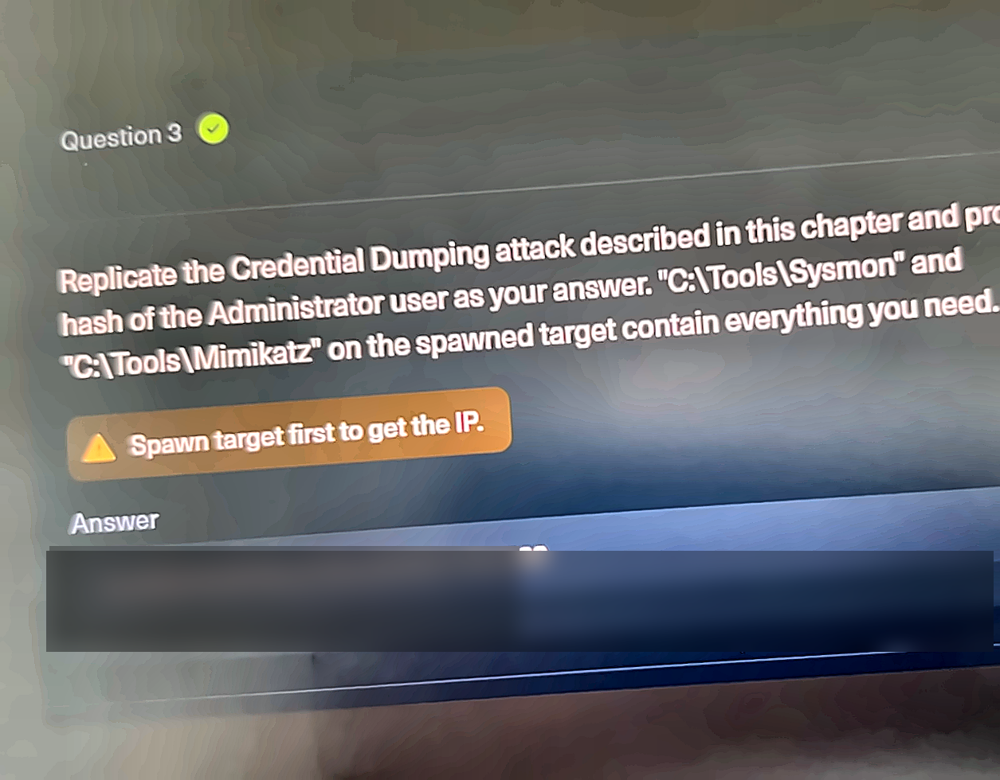

---

## Phase 1: Windows Event Log and Sysmon Preparation

The first phase of the project involved preparing the Windows target for log analysis. I accessed the target machine through RDP and opened Windows Event Viewer to review the available log sources.

The key log source used for this project was:

```text
Applications and Services Logs
└── Microsoft
    └── Windows
        └── Sysmon
            └── Operational
```

Sysmon was important because it provides deeper endpoint telemetry than default Windows logs. For this lab, Sysmon was used to observe DLL loading behavior, process activity, and attack-related artifacts.

I also used PowerShell to query logs more efficiently instead of manually scrolling through Event Viewer.

Example log query used during the investigation:

```powershell
Get-WinEvent -LogName "Microsoft-Windows-Sysmon/Operational" |
Where-Object {
    $_.Message -match "ImageLoaded"
} |
Select-Object TimeCreated, Id, Message |
Format-List
```

This allowed me to search for relevant events faster and focus on specific evidence.

---

## Phase 2: DLL Hijacking Simulation

The first attack simulation involved DLL hijacking. DLL hijacking occurs when an application loads a malicious DLL instead of the legitimate one it was expected to load.

In this lab, the malicious DLL was named:

```text
WININET.dll
```

The attack was replicated by placing the malicious DLL in a location where a program would load it during execution. After execution, Sysmon logs were reviewed to confirm that the DLL was loaded.

The most important Sysmon evidence for this phase was:

```text
Event ID: 7
Event Type: Image loaded
ImageLoaded: WININET.dll
Hashes: SHA256=<hash>
```

The final answer required the SHA256 hash of the malicious `WININET.dll`.

PowerShell was used to extract the hash:

```powershell
Get-FileHash "C:\Path\To\WININET.dll" -Algorithm SHA256
```

### Key Evidence Collected

| Evidence Type | Value |
|---|---|
| Attack Technique | DLL Hijacking |
| Suspicious File | WININET.dll |
| Log Source | Sysmon Operational |
| Relevant Event ID | 7 |
| Evidence Collected | SHA256 hash of malicious DLL |

### SOC Analyst Relevance

DLL hijacking is relevant to SOC work because attackers may use it for stealthy execution, persistence, or defense evasion. A SOC Analyst may detect this behavior by looking for unusual DLL loads, suspicious file paths, or DLLs loaded from user-writable directories.

Examples of suspicious indicators include:

- DLLs loaded from a user profile or temporary directory.
- DLL names matching legitimate Windows DLLs but located outside normal Windows directories.
- Unexpected parent-child process relationships.
- Newly created or modified DLLs shortly before execution.

---

## Phase 3: Unmanaged PowerShell Attack Simulation

The second attack simulation involved unmanaged PowerShell injection. This technique allows PowerShell functionality to be executed inside another process instead of launching the normal `powershell.exe` process.

In this lab, the target process was:

```text
spoolsv.exe
```

The investigation focused on identifying the `clrjit.dll` file loaded by `spoolsv.exe`.

The most important Sysmon evidence for this phase was:

```text
Event ID: 7
Image: C:\Windows\System32\spoolsv.exe
ImageLoaded: C:\Windows\Microsoft.NET\Framework64\v4.0.30319\clrjit.dll
Hashes: SHA256=<hash>
```

A PowerShell query was used to locate the event:

```powershell
Get-WinEvent -LogName "Microsoft-Windows-Sysmon/Operational" |
Where-Object {
    $_.Message -match "Image: C:\\Windows\\System32\\spoolsv\.exe" -and
    $_.Message -match "ImageLoaded:.*clrjit\.dll"
} |
Select-Object TimeCreated, Id, Message |
Format-List
```

### Key Evidence Collected

| Evidence Type | Value |
|---|---|
| Attack Technique | Unmanaged PowerShell |
| Target Process | spoolsv.exe |
| Loaded DLL | clrjit.dll |
| Log Source | Sysmon Operational |
| Relevant Event ID | 7 |
| Evidence Collected | SHA256 hash of clrjit.dll |

### SOC Analyst Relevance

This phase is relevant to SOC work because attackers often try to avoid detection by executing code in trusted Windows processes. Instead of seeing obvious `powershell.exe` activity, an analyst may need to identify unusual .NET-related DLL loads or unexpected behavior from legitimate processes.

`spoolsv.exe` is normally associated with the Windows Print Spooler service. Seeing it load .NET components such as `clrjit.dll` can be suspicious depending on the environment and should trigger further investigation.

A SOC Analyst would ask:

- Why is `spoolsv.exe` loading .NET runtime components?
- Did this happen after suspicious process injection activity?
- Was there a related PowerShell script or encoded command?
- Did the activity originate from an unusual parent process?
- Was this behavior expected for the host?

---

## Phase 4: Credential Dumping Simulation

The third attack simulation involved credential dumping. In this phase, a lab version of Mimikatz was used to simulate the extraction of credential material from memory.

The objective was to locate the NTLM hash for the `Administrator` account.

The relevant evidence was found in the Mimikatz output:

```text
Username : Administrator
NTLM     : <hash>
```

### Key Evidence Collected

| Evidence Type | Value |
|---|---|
| Attack Technique | Credential Dumping |
| Tool Used | Mimikatz lab binary |
| Target Account | Administrator |
| Evidence Collected | NTLM hash |

### SOC Analyst Relevance

Credential dumping is highly relevant to SOC analysis because it is commonly associated with privilege escalation and lateral movement. Attackers often attempt to dump credentials after gaining access to a system so they can move to other hosts or access sensitive resources.

A SOC Analyst should treat credential dumping activity as high severity because it may indicate that an attacker is attempting to expand access within the environment.

Important detection points include:

- Suspicious access to LSASS memory.
- Execution of known credential dumping tools.
- Unexpected administrative process behavior.
- Security tools alerting on credential theft behavior.
- New authentication attempts after credential dumping activity.

---

## Investigation Summary

During this project, I replicated three attack techniques and collected evidence from the Windows target.

| Phase | Technique | Primary Evidence |
|---|---|---|
| 1 | DLL Hijacking | SHA256 hash of malicious WININET.dll |
| 2 | Unmanaged PowerShell | SHA256 hash of clrjit.dll loaded by spoolsv.exe |
| 3 | Credential Dumping | NTLM hash of Administrator user |

The most useful log source was Sysmon Operational because it provided detailed endpoint telemetry that helped identify loaded DLLs and process behavior.

---

## What I Learned

This project helped me understand how Windows host activity can be investigated from a SOC perspective. I practiced moving from attack execution to evidence collection, using logs to confirm what happened on the system.

Key lessons learned:

- Windows Event Logs are essential for endpoint investigation.
- Sysmon provides richer telemetry than default Windows logs.
- Event ID 7 is useful for analyzing DLL loading behavior.
- File hashes are important indicators for investigation and reporting.
- Legitimate Windows processes can be abused by attackers.
- Credential dumping is a serious post-exploitation behavior.
- PowerShell can be used both by administrators and attackers, so context matters.
- SOC Analysts need to correlate process activity, file paths, hashes, and user activity.

---

## Why This Project Matters for SOC Analyst Work

This project is directly relevant to SOC Analyst responsibilities because it reflects the type of investigation analysts perform when reviewing endpoint alerts.

A SOC Analyst may receive alerts related to:

- Suspicious DLL loads
- Possible process injection
- PowerShell abuse
- Credential dumping
- Mimikatz-like activity
- Suspicious access to sensitive processes
- Hash-based malware indicators

In each case, the analyst must determine what happened, collect evidence, and decide whether the behavior is benign or malicious.

This lab helped me practice:

- Identifying suspicious host behavior.
- Using logs to validate an alert.
- Extracting indicators of compromise.
- Understanding attacker techniques at the endpoint level.
- Writing clear documentation of findings.

---

## MITRE ATT&CK Mapping

| Technique | MITRE ATT&CK ID | Description |
|---|---|---|
| DLL Search Order Hijacking | T1574.001 | Abuse of DLL loading behavior to execute malicious code |
| Process Injection | T1055 | Injecting code into another process |
| PowerShell | T1059.001 | Use of PowerShell for execution |
| OS Credential Dumping | T1003 | Attempting to dump credentials from the operating system |
| LSASS Memory | T1003.001 | Credential dumping from LSASS memory |

---

## Defensive Takeaways

Based on the activity performed in this lab, useful defensive recommendations include:

- Deploy Sysmon with a strong configuration.
- Monitor DLL loads from unusual directories.
- Alert on suspicious DLL names loaded outside expected paths.
- Monitor trusted Windows processes for abnormal module loads.
- Investigate unexpected .NET runtime loading by system processes.
- Monitor access to LSASS memory.
- Alert on known credential dumping tool behavior.
- Collect and preserve hashes of suspicious files.
- Correlate endpoint events with authentication logs.

---

## Conclusion

This project gave me hands-on practice with Windows event log analysis, Sysmon investigation, and attack simulation in a controlled lab environment. I replicated DLL hijacking, unmanaged PowerShell injection, and credential dumping techniques, then collected the relevant evidence needed to answer investigation questions.

From a SOC Analyst perspective, this project helped me build practical experience in identifying suspicious endpoint behavior, extracting useful indicators, and documenting findings clearly.

This is the kind of workflow SOC Analysts use when investigating alerts, validating suspicious activity, and supporting incident response.

---

## Portfolio Notes

This project demonstrates beginner-to-intermediate SOC Analyst skills, including:

- Endpoint log analysis
- Sysmon investigation
- Windows security event review
- PowerShell log querying
- Attack behavior recognition
- IOC extraction
- Evidence-based reporting

All work was completed in a legal, isolated training environment.
